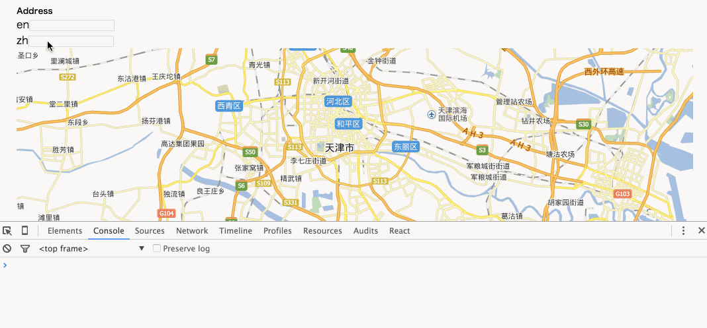

# React Baidu Map

[![NPM version][npm-image]][npm-url]
[![Build status][travis-image]][travis-url]
[![Dependency Status][david-image]][david-url]
[![Downloads][downloads-image]][downloads-url]

react component to work with baidu javascript API which enables you search, pinch and more

## Installation

```sh
$ npm install --save react-baidu-map
```

## Demo



## Usage

The following is an example to show how it works with a search input to get
position of every marker from the map in real-time.

```jsx
import { BaiduMap } from 'react-baidu-map';

class ExampleApp extends React.Component {
  render() {
    return (
      <div>
        <input onChange={this.onChange.bind(this)} />
        <BaiduMap id="location" ref="location" style={{height: 300}}
          onSelect={this.onSelect} />
      </div>
    );
  }
  onChange(event) {
    this.refs.location.search(event.target.value);
  }
  onSelect(point) {
    // point.lng
    // point.lat
  }
}
```

Before you start working on coding with Baidu API, you should add script to your main script:

```html
<script type="text/javascript" src="http://api.map.baidu.com/api?v=2.0&ak=your_key"></script>
```

## API

### Props

- `id` {String} the id to create the map element in DOM tree, default value: "allmap".
- `style` {Object} the style sheet to apply to the root element of this component.
- `onSelect` {Function} this function will be fired when user click a marker and the info bubble is shown
  - `point` {Point} the position of being clicked to some maker
    - `lng` {String} the `lng` of the point.
    - `lat` {String} the `lat` of the point.

### Methods

##### `search(text: string): void`

Search by keyword from the created map context.

## License

MIT Licensed and WeFlex Copyright

[npm-image]: https://img.shields.io/npm/v/react-baidu-map.svg?style=flat-square
[npm-url]: https://npmjs.org/package/react-baidu-map
[travis-image]: https://img.shields.io/travis/weflex/react-baidu-map.svg?style=flat-square
[travis-url]: https://travis-ci.org/weflex/react-baidu-map
[david-image]: http://img.shields.io/david/weflex/react-baidu-map.svg?style=flat-square
[david-url]: https://david-dm.org/weflex/react-baidu-map
[downloads-image]: http://img.shields.io/npm/dm/react-baidu-map.svg?style=flat-square
[downloads-url]: https://npmjs.org/package/react-baidu-map

